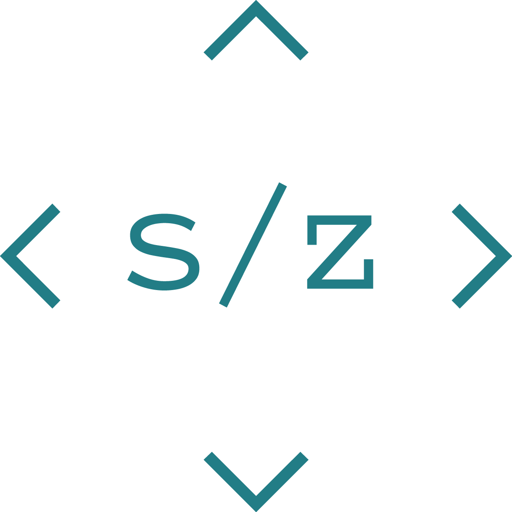
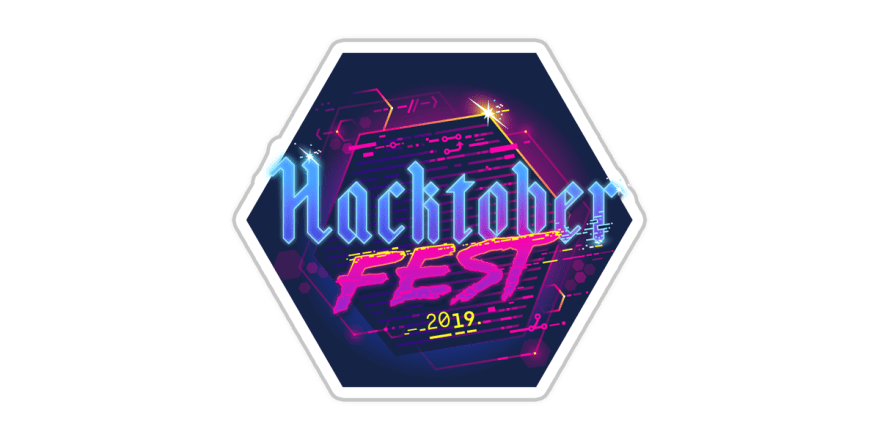

    

<h1 align="center">
  Hello 👋, I'm Steven Zemelka
</h1>

> I'm a Software Developer at valantic CEC Deutschland GmbH and Symfony, IoT, DevOps, Automation and Smart Home enthusiast 👨🏻‍💻

  ---

  

### Boy Scout Rule

I love open source.  I am not a heavy maintainer of any large libraries, but I really like the boyscout rule.  I contribute to things as I come across issues that I think other people might struggle with.  This may be things that are overlooked by someone who is deep into the library.  I 💕 a good onboarding readme with good example.

 ---
### Talking about Personal Stuffs:

- 🛠 &nbsp; I’m currently working mostly with Symfony, Shopware and Spryker within the E-Commerce context @work.
- 💻 &nbsp; I love exploring new tech stack and building cool stuffs.
- ❤️ &nbsp; Attending Hackathons, meetups & tech events.
- 🔨 &nbsp; In my private time i linke to tinker with docker, node-red, homebridge and many other automation IoT / smart home technologies 

---

#### 📈 My GitHub Statistics

### Show some ❤️ by ⭐ some of my repositories!

